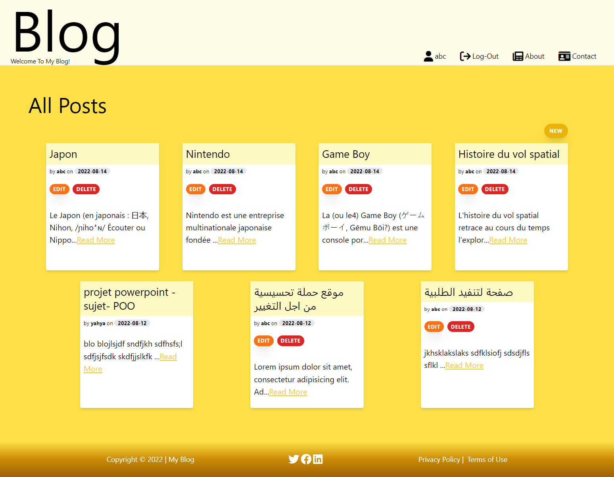

# Blog Web App With Flask and SQLite


## Introduction

> This is a simple web app that I built to practice my skills in building web apps.

## Screenshots

* All posts

* Details of post

* Edit post

* Contact

* About

* Register

* Login


## Build With:

| Front End      | Back End       | database     |
|----------------|----------------|--------------|
| HTML `JinJa`   | Python `Flask` | SQL `SQLite` |
| CSS `Tailwind` |                |              |
| JS             |                |              |

## Instructions

- [x] Create a web app that allows users to create a blog post.
- [x] The user should be able to see all the posts that have been created.
- [x] The user should be able to see a single post when they click on the title of the post.
- [x] The user should be able to edit a post.
- [x] The user should be able to delete a post.


## Requirements

* [Flask](https://flask.palletsprojects.com/en/2.2.x/)
* [SQLite](https://sqlite.com/index.html)
* [TailwindCSS](https://tailwindcss.com/)
* [Font Awesome](https://fontawesome.com/)

## Installation

* Install dependencies:

```bash
pip install -r requirements.txt
```

* To Run Initial database:

```bash
$ flask --app flaskr init-db
Initialized the database.
```

## Usage

* ***watch mode*** Run the app with the following command:

```bash
flask --app my_blog --debug run
```

## Contributing

> Contributions are welcome!